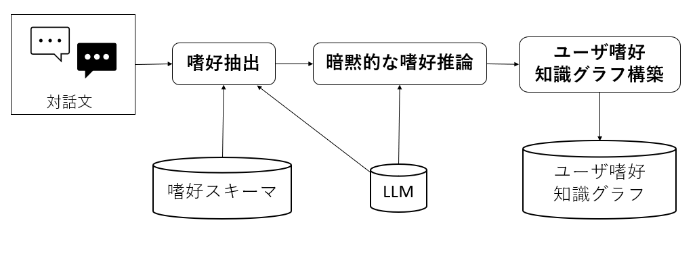
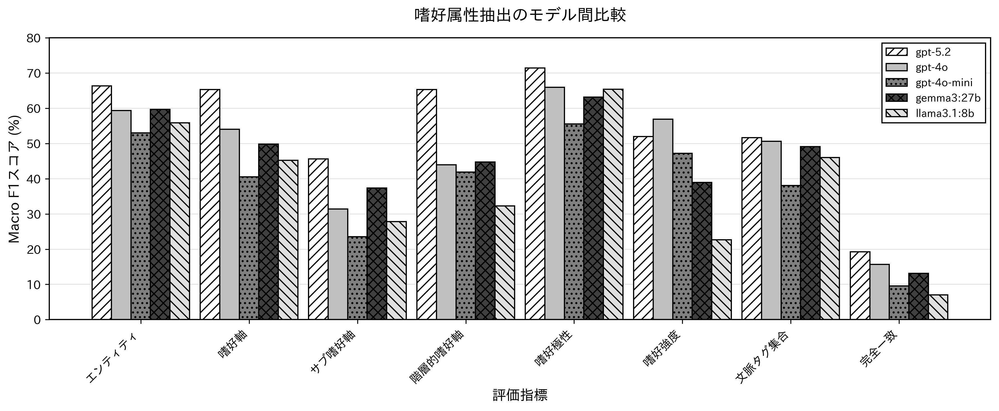
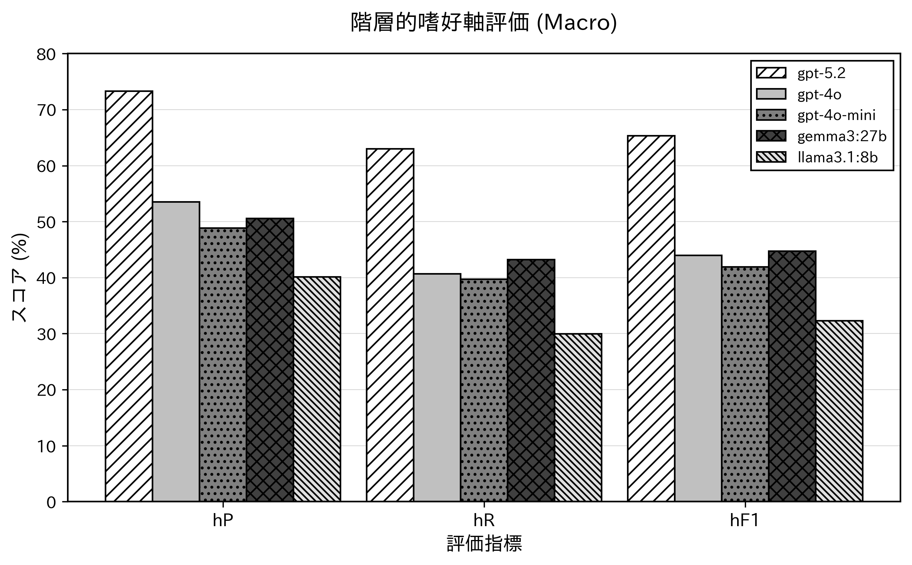
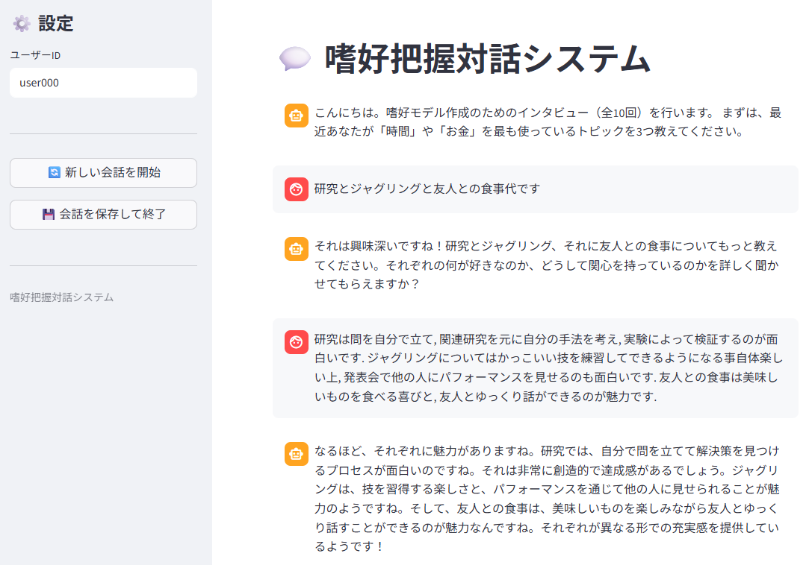

# LLM Preference Extraction

**独自の3軸嗜好スキーマに基づき、対話からユーザー嗜好を構造化抽出し、知識グラフを構築するパイプライン**

Liking（快楽的嗜好）/ Wanting（動機的嗜好）/ Need（実利的嗜好）の3軸スキーマを設計し、LLM による Few-shot + Chain-of-Thought 抽出と暗黙的嗜好推論を組み合わせて、対話データからユーザー嗜好を知識グラフとして構造化します。5つのモデル（GPT-5.2 / GPT-4o / GPT-4o-mini / Gemma3:27b / Llama3.1:8b）を用いた定量評価により抽出精度を多角的に検証しています。



---

## Demo Notebooks
コードを読む前に、実際のデータ処理フローと評価分析を Notebook で確認できます。

- **[01_demo_pipeline.ipynb](notebooks/01_demo_pipeline.ipynb)** :
  - **対話データ → 知識グラフ** への変換プロセスを可視化したデモ。
  - 実際のETLフロー（抽出・推論・構築）と生成されるグラフ構造を確認できます。

- **[02_result_analysis.ipynb](notebooks/02_result_analysis.ipynb)** :
  - 5つのモデル（GPT-5.2 / 4o / Llama3 等）を用いた **定量評価（F1 Score, Accuracy）** の詳細分析。
  - モデルごとの強み・弱みの統計的評価。

## 特徴

- **3軸嗜好スキーマ** — Liking / Wanting / Need の体系で嗜好を分類し、sub_axis・polarity・intensity・context を付与
- **Few-shot + CoT 抽出** — Chain-of-Thought 推論を伴う Few-shot プロンプトで明示的嗜好を構造化抽出
- **暗黙的嗜好推論** — 対話に直接現れない嗜好を LLM で推論し、元の発話と紐づけ
- **知識グラフ構築** — 抽出結果を `(user, relation, entity)` トリプレットに変換
- **多角的評価フレームワーク** — Entity / Axis / Polarity / Intensity / Context の各指標で Micro・Macro・Weighted F1 を算出

---

## 評価結果

DailyDialog コーパスから選定した対話データと、独自アノテーションによるグラウンドトゥルースを用いて、5モデルの抽出精度を比較しています。

### Macro F1 モデル間比較



| Model | Entity | Axis | H-Axis | Polarity | Intensity | Context | Perfect |
|-------|--------|------|--------|----------|-----------|---------|---------|
| **gpt-5.2** | **0.664** | **0.653** | **0.653** | **0.715** | 0.520 | 0.517 | **0.192** |
| gpt-4o | 0.594 | 0.540 | 0.440 | 0.660 | **0.569** | 0.507 | 0.157 |
| gpt-4o-mini | 0.530 | 0.406 | 0.419 | 0.556 | 0.472 | 0.381 | 0.096 |
| gemma3:27b | 0.597 | 0.498 | 0.448 | 0.632 | 0.389 | 0.491 | 0.131 |
| llama3.1:8b | 0.559 | 0.453 | 0.323 | 0.654 | 0.226 | 0.460 | 0.070 |

### 階層的嗜好軸評価 (Macro)

Axis → Sub-Axis の階層構造を考慮した Hierarchical Precision / Recall / F1 です。



| Model | hP | hR | hF1 |
|-------|-----|-----|------|
| **gpt-5.2** | **0.733** | **0.630** | **0.653** |
| gpt-4o | 0.535 | 0.407 | 0.440 |
| gpt-4o-mini | 0.488 | 0.397 | 0.419 |
| gemma3:27b | 0.506 | 0.432 | 0.448 |
| llama3.1:8b | 0.401 | 0.299 | 0.323 |

---

## 知識グラフ出力例

対話から構築された KG トリプレットの例:

```json
{
  "head": "user00",
  "relation": "liking__stimulation",
  "tail": "ジャグリング",
  "type": "explicit",
  "attributes": {
    "polarity": "positive",
    "intensity": "medium",
    "context_tags": [],
    "original_mention": "ジャグリングはできる技を増やす事自体楽しいし, サークルメンバーとの交流も魅力の一つ."
  }
}
```

```json
{
  "head": "user00",
  "relation": "implicit_preference",
  "tail": "友人との交流を重視する傾向がある",
  "type": "implicit",
  "attributes": {
    "original_mention": "お金はあまり使っておらず, 強いて言えば友人との外食に使っている."
  }
}
```

---

## 対話アプリ

上記の嗜好抽出パイプラインを活用した、Streamlit ベースのインタビュー対話システムです。ユーザーとの対話を通じて嗜好を収集し、知識グラフとして蓄積します。



```bash
make app    # http://localhost:8501
```

---

## セットアップ

```bash
git clone <repository-url>
cd llm-preference-extraction

# 環境構築 (uv)
make setup
source .venv/bin/activate

# .env に OPENAI_API_KEY を設定
cp .env.example .env
```

**必要環境**: Python ≥ 3.11 / [uv](https://docs.astral.sh/uv/) / OpenAI API Key

---

## 使い方

### 実験パイプライン

```bash
make extract     # 対話から嗜好を抽出
make evaluate    # Ground Truth と比較評価
make plot        # 結果グラフ描画 → reports/figures/
```

### 開発

```bash
make lint        # ruff によるリント
make format      # コード整形
make test        # テスト実行
```

---

## プロジェクト構成

```
llm-preference-extraction/
├── llm_preference_extraction/   # コアパッケージ
│   ├── extractors.py            #   Few-shot 明示的嗜好抽出
│   ├── reasoners.py             #   暗黙的嗜好推論・統合
│   ├── graph_builder.py         #   KG トリプレット構築
│   └── evaluation/              #   評価サブパッケージ (8モジュール)
│       ├── dialogue_evaluator.py
│       ├── aggregators.py       #     Micro/Macro/Weighted F1
│       ├── matching.py          #     意味的類似度ベース最適マッチング
│       └── ...
│
├── experiments/                 # 実験スクリプト
│   ├── run_extraction.py
│   ├── run_evaluation.py
│   └── plot_evaluation.py
│
├── app/                         # Streamlit 対話アプリ
│   ├── main.py
│   └── components/
│
├── data/
│   ├── prompts/                 # プロンプトテンプレート (CoT / 推論)
│   ├── ground_truth/            # DailyDialog アノテーション済データ
│   ├── results/                 # 評価結果
│   └── output_samples/          # KG 出力サンプル
│
├── notebooks/                   # 分析ノートブック
├── reports/figures/             # 評価グラフ (PNG / PDF)
└── docs/images/                 # スクリーンショット
```

---

## 技術スタック

| カテゴリ | 技術 |
|----------|------|
| LLM API | OpenAI API (GPT-5.2 / 4o / 4o-mini), Ollama (Gemma3, Llama3.1) |
| 嗜好抽出 | Few-shot Prompting, Chain-of-Thought, JSON Schema 制約付き生成 |
| 類似度計算 | OpenAI Embeddings |
| 評価 | MacroF1, MicroF1, WeightedF1 |
| アプリ | Streamlit |
| パッケージ管理 | uv + hatchling |
| コード品質 | Ruff (lint + format), pytest |

---

## ライセンス

MIT License
